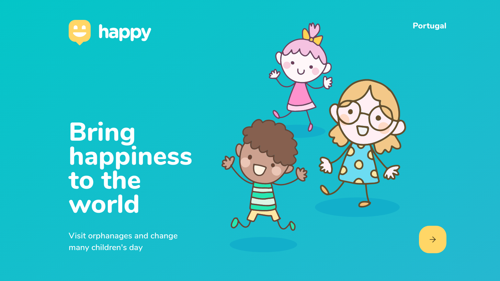

# Happy
The Happy goal is to help people to understand and contribute to the lives of orphaned children. 
With this application you can see the residential institutions for the care and protection of orphans and ask for a visit.

  

## Tools
- Node.js
- React
- React Native
- Expo
- TypeScript

## Instructions
1. Enter in the directories backend, mobile and web.
2. In each one, you need to install all projects dependencies. 
  * Use your terminal for execute the commands below:
    * yarn install
    * For the backend you also need to execute this command: yarn typeorm migration:run.
    * yarn start
3. Now you can see the web application using this address: http://localhost:3000.
4. For access the mobile app you need to follow the Expo instructions in your terminal.
5. That's it!

The project was developed in the NLW event provided by Rocketseat 💜
